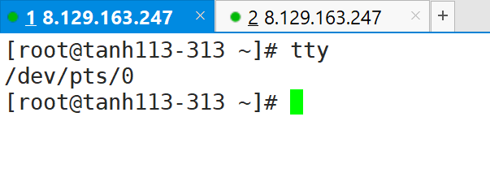

# Linux基础

```
init 3(命令) 5(图形) 0(关机) 6(重启)
```


> id-u

为0的时候是管理员，其他值都是普通用户

~~~
[root@tanh113-313 ~]# id -u
0
[root@tanh113-313 ~]# 
~~~

> tty

查看当前的终端设备




> free -h //查看当前的内存情况

```
[root@tanh113-313 ~]# free -h
              total        used        free      shared  buff/cache   available
Mem:          3.7Gi       150Mi       3.3Gi       1.0Mi       272Mi       3.3Gi
Swap:            0B          0B          0B
[root@tanh113-313 ~]# 

```

> who am i //分开写，可以直接查看当前用户和终端

~~~
[root@tanh113-313 ~]# who am i
root     pts/0        2021-01-13 17:14 (183.230.102.101)
~~~


