# Linux系统下常见的命令

使用ls命令来显示有哪些文件，或者使用ls -l，最简单的是ll。ls命令会把文件横向显示，看着不舒服，ll和ls -l是一样的效果，建议使用ll，因为它最简单

## 文件目录管理命令

### tree

命令描述：tree命令用于以树状图列出目录的内容。

tree命令没有内置在系统中，使用tree命令需要执行以下命令来安装：

```
yum install -y tree
```

命令使用示例：

```
tree /usr/share/wallpapers/
```

命令输出结果：

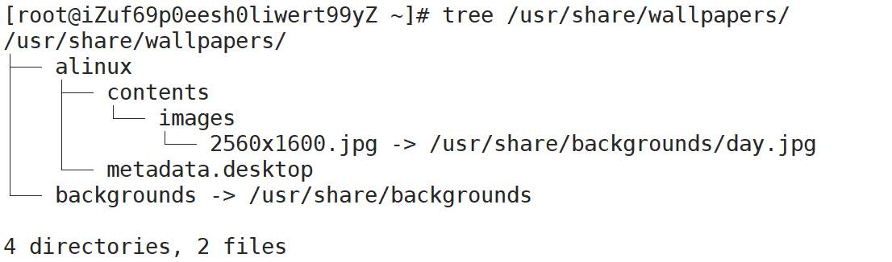

### ls

命令描述： ls命令用于显示指定工作目录下的内容。

命令格式：`ls [参数] [目录名]`。

参数说明：

| 参数 | 说明                                                         |
| :--- | :----------------------------------------------------------- |
| -a   | 显示所有文件及目录（包括隐藏文件）                           |
| -l   | 将文件的权限、拥有者、文件大小等详细信息列出（`ll`等同于`ls -l`） |
| -r   | 将文件反序列出（默认按英文字母正序）                         |
| -t   | 将文件按创建时间正序列出                                     |
| -R   | 递归遍历目录下文件                                           |

命令使用示例：

查看当前目录下的所有文件（包括隐藏文件）。

```
ll -a
```

命令输出结果：

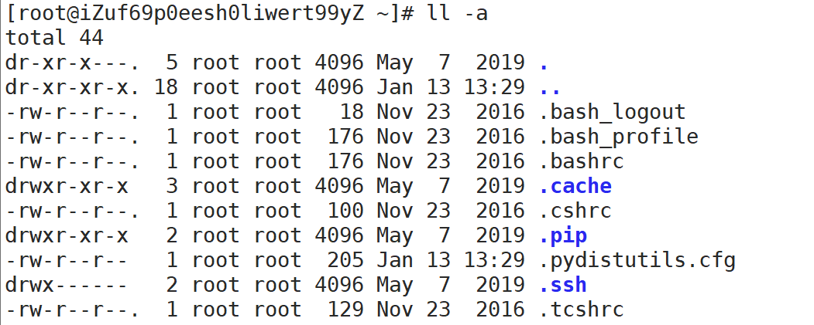

### pwd

命令描述：获取当前工作目录的绝对路径。

命令使用示例：

~~~
[root@iZuf69p0eesh0liwert99yZ ~]# pwd
/root
~~~

### cd

命令描述：cd命令用于切换工作目录。

命令使用示例：

~~~
[root@iZuf69p0eesh0liwert99yZ usr]# cd local/etc/
[root@iZuf69p0eesh0liwert99yZ etc]# pwd
/usr/local/etc
[root@iZuf69p0eesh0liwert99yZ etc]# cd /
[root@iZuf69p0eesh0liwert99yZ /]# pwd
/
[root@iZuf69p0eesh0liwert99yZ /]# cd /root/
[root@iZuf69p0eesh0liwert99yZ ~]# pwd
/root
~~~

> 在路径表示中：
>
> - 一个半角句号（`.`）表示当前目录，例如路径./app/log等同于app/log。
> - 两个半角句号（`..`）表示上级目录，例如路径/usr/local/../src等同于/usr/src，其中local和src目录同级。
>
> `cd`命令的默认参数为`~`，符号`~`表示当前用户的家目录，即在root用户登录时，命令`cd`、`cd ~`和`cd /root`执行效果相同。

### touch

命令描述：touch命令用于修改文件或者目录的时间属性，包括存取时间和更改时间。若文件不存在，系统会建立一个新的文件。

命令格式：`touch [参数] [文件]`。

参数说明：

| 参数 | 说明                               |
| :--- | :--------------------------------- |
| -c   | 如果指定文件不存在，不会建立新文件 |
| -r   | 使用参考文件的时间记录             |
| -t   | 设置文件的时间记录                 |


命令使用示例：

- 创建两个空文件。

~~~
[root@iZuf69p0eesh0liwert99yZ ~]# touch demo1.txt demo2.text
[root@iZuf69p0eesh0liwert99yZ ~]# ll
total 0
-rw-r--r-- 1 root root 0 Jan 13 13:45 demo1.txt
-rw-r--r-- 1 root root 0 Jan 13 13:45 demo2.text
~~~

- 修改demo1.txt的时间记录为当前系统时间。

~~~
[root@iZuf69p0eesh0liwert99yZ ~]# touch demo1.txt
[root@iZuf69p0eesh0liwert99yZ ~]# ll
total 0
-rw-r--r-- 1 root root 0 Jan 13 13:48 demo1.txt
-rw-r--r-- 1 root root 0 Jan 13 13:45 demo2.text
~~~

- 更新demo2.txt的时间记录，使其和demo1.txt的时间记录相同。

~~~
[root@iZuf69p0eesh0liwert99yZ ~]# touch -r demo1.txt demo2.text 
[root@iZuf69p0eesh0liwert99yZ ~]# ll
total 0
-rw-r--r-- 1 root root 0 Jan 13 13:48 demo1.txt
-rw-r--r-- 1 root root 0 Jan 13 13:48 demo2.text
~~~

### mkdir

命令描述：mkdir命令用于新建子目录。`-p`参数确保目录名称存在，不存在的就新建一个。

命令使用示例：

新建目录a/b/c/d，并使用tree命令查看创建后的目录结构。

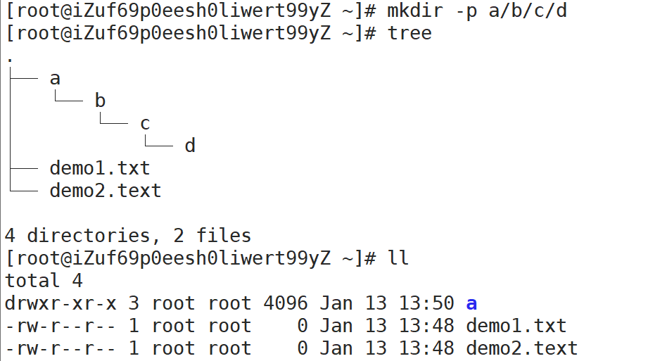

### rm

命令描述：rm命令用于删除一个文件或者目录。

命令格式：`rm [参数] [文件]`。

参数说明：

| 参数 | 说明               |
| :--- | :----------------- |
| -i   | 删除前逐一询问确认 |
| -f   | 无需确认，直接删除 |
| -r   | 删除目录下所有文件 |

命令使用示例：

无需确认直接删除文件。

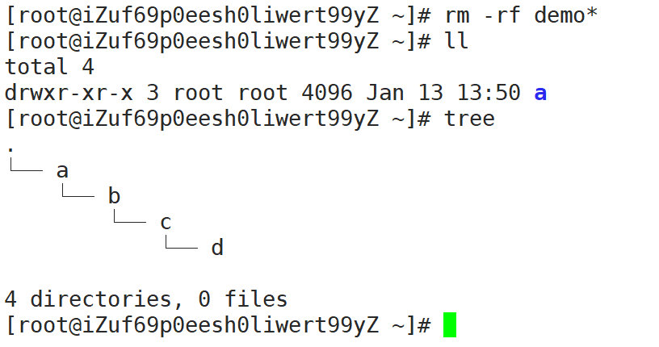

无需确认直接删除目录a及其目录下所有子目录和文件。

~~~
[root@iZuf69p0eesh0liwert99yZ ~]# rm -rf a
[root@iZuf69p0eesh0liwert99yZ ~]# ll
total 0
[root@iZuf69p0eesh0liwert99yZ ~]# 
~~~

### cp

命令描述： cp命令主要用于复制文件或目录。

命令格式：`cp [参数] [源文件] [目标文件]`。

参数说明：

| 参数 | 说明                                                       |
| :--- | :--------------------------------------------------------- |
| -d   | 复制时保留链接                                             |
| -f   | 覆盖已经存在的目标文件而不给出提示                         |
| -i   | 覆盖前询问                                                 |
| -p   | 除复制文件的内容外，还把修改时间和访问权限也复制到新文件中 |
| -r   | 复制目录及目录内的所有项目                                 |

命令使用示例：

将目录c/d中的所有内容复制到目录a/b下。

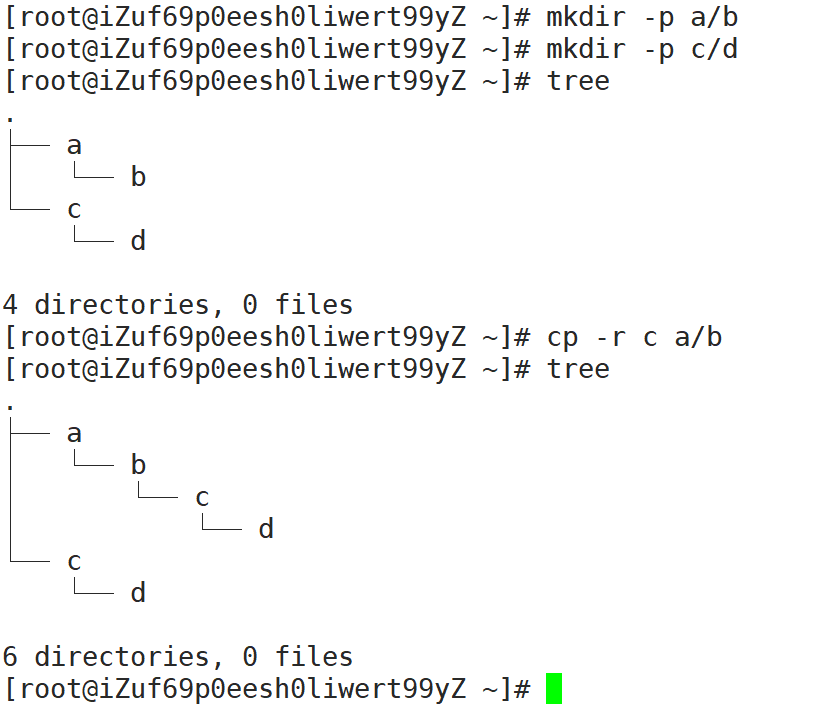

### mv

命令描述： mv命令用来为文件或目录改名、或将文件或目录移入其它位置。

命令格式：`mv [参数] [源文件] [目标文件]`

参数说明：

| 参数 | 说明                                           |
| :--- | :--------------------------------------------- |
| -i   | 若指定目录已有同名文件，则先询问是否覆盖旧文件 |
| -f   | 如果目标文件已经存在，不会询问而直接覆盖       |

命令使用示例：

- 将文件名a.txt改为b.txt。

~~~
[root@iZuf69p0eesh0liwert99yZ ~]# touch a.txt
[root@iZuf69p0eesh0liwert99yZ ~]# ll
total 8
drwxr-xr-x 3 root root 4096 Jan 13 14:15 a
-rw-r--r-- 1 root root    0 Jan 13 14:17 a.txt
drwxr-xr-x 3 root root 4096 Jan 13 14:15 c
[root@iZuf69p0eesh0liwert99yZ ~]# mv a.txt b.txt
[root@iZuf69p0eesh0liwert99yZ ~]# ll
total 8
drwxr-xr-x 3 root root 4096 Jan 13 14:15 a
-rw-r--r-- 1 root root    0 Jan 13 14:17 b.txt
drwxr-xr-x 3 root root 4096 Jan 13 14:15 c
[root@iZuf69p0eesh0liwert99yZ ~]# 
~~~

* 将c目录移动到a/b/c/d/下。

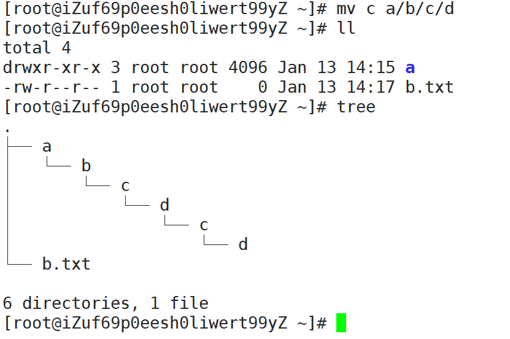

- 将当前目录内容全部移动到/tmp目录中。

~~~
[root@iZuf69p0eesh0liwert99yZ ~]# mv ./* /tmp/
~~~


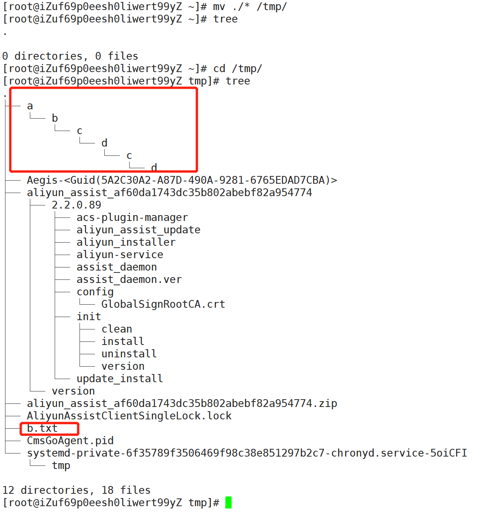

### rename

命令描述：rename命令用字符串替换的方式批量改变文件名。rename命令有C语言和Perl语言两个版本，这里介绍C语言版本的rename命令，不支持正则表达式。

命令使用示例：

- 将当前目录下所有文件名中的字符串demo改为大写的字符串DEMO。

~~~
[root@iZuf69p0eesh0liwert99yZ ~]# touch demo1.txt demo2.txt
[root@iZuf69p0eesh0liwert99yZ ~]# ll
total 0
-rw-r--r-- 1 root root 0 Jan 13 14:27 demo1.txt
-rw-r--r-- 1 root root 0 Jan 13 14:27 demo2.txt
[root@iZuf69p0eesh0liwert99yZ ~]# rename demo DEMO *
[root@iZuf69p0eesh0liwert99yZ ~]# ll
total 0
-rw-r--r-- 1 root root 0 Jan 13 14:27 DEMO1.txt
-rw-r--r-- 1 root root 0 Jan 13 14:27 DEMO2.txt
~~~

将当前目录下所有`.txt`文件后缀都改为`text`。

~~~
[root@iZuf69p0eesh0liwert99yZ ~]# rename .txt .text *
[root@iZuf69p0eesh0liwert99yZ ~]# ll
total 0
-rw-r--r-- 1 root root 0 Jan 13 14:27 DEMO1.text
-rw-r--r-- 1 root root 0 Jan 13 14:27 DEMO2.text
[root@iZuf69p0eesh0liwert99yZ ~]# 
~~~


## 文件权限管理

ls命令可以查看Linux系统上的文件、目录和设备的权限。

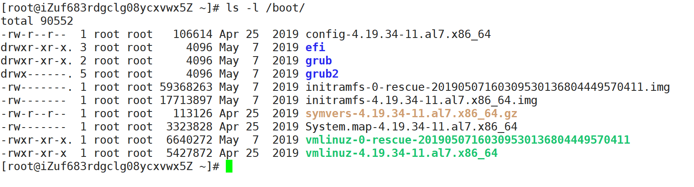

上述`ls -l`命令中显示的第一列就是文件权限信息，共11位字符，分5部分。

- 第1位表示存档类型，`d`表示目录，`-`表示一般文件。
- 第2~4位表示当前用户的权限（属主权限）。
- 第5~7位表示同用户组的用户权限（属组权限）。
- 第8~10位表示不同用户组的用户权限（其他用户权限）。
- 第11位是一个半角句号`.`，表示SELinux安全标签。

用户权限每组三位，rwx分别表示读、写、执行权限，对应八进制表示为4、2、1。

例如efi目录的root用户权限为`drwxr-xr-x.`。

- 该目录对root用户具有读写和执行所有权限。
- 该目录对root组其他用户有读和执行权限。
- 该目录对其他用户有读和执行权限。

所以该权限表示对应八进制权限表示为：

- 属主权限：`4+2+1=7`。
- 属组权限：`4+1=5`。
- 其他用户权限：4+1=5。

即755。


### chmod

chmod命令用于修改文件权限mode，`-R`参数以递归方式对子目录和文件进行修改。

命令使用示例：

1. 新建名为hello.sh的Shell脚本，该脚本将会输出`Hello World`。用`ll`命令可以看到新建的脚本没有执行权限，其权限用八进制表示为644。

~~~
echo "echo 'Hello World'" > hello.sh
~~~

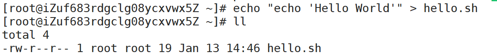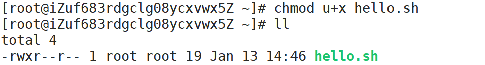

2. 将hello.sh文件增加属主的执行权限。

~~~
chmod u+x hello.sh
~~~


3. 将hello.sh文件撤销属主的执行权限。

```
chmod u-x hello.sh
```

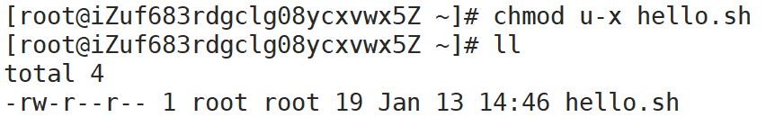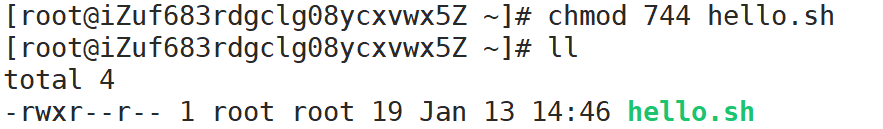

4. 将hello.sh文件权限修改为八进制表示的744权限。

```
chmod 744 hello.sh
```


5. 使用bash命令解释器执行hello.sh脚本文件。

```
/bin/bash hello.sh
```

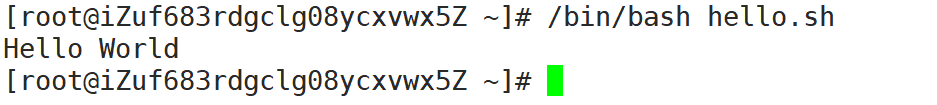

其中，`u+x`表示增加属主的执行权限，u表示属主，g表示属组，o表示其他，a表示所有用户。

### chown

chown命令修改文件的属主和属组；`-R`参数以递归方式对子目录和文件进行修改；`ls -l`命令显示的第三列和第四列就是文件的属主和属组信息。

命令使用示例：

1. 新建一个文本文件test.txt，用`ll`命令可以看到该文件的属主和属组是root。`whoami`命令可以查看当前Shell环境登录的用户名。

```
whoami
touch test.txt
ll
```

~~~
[root@iZuf683rdgclg08ycxvwx5Z ~]# whoami 
root
[root@iZuf683rdgclg08ycxvwx5Z ~]# touch text.txt
[root@iZuf683rdgclg08ycxvwx5Z ~]# ll
total 0
-rw-r--r-- 1 root root 0 Jan 13 15:03 text.txt
[root@iZuf683rdgclg08ycxvwx5Z ~]# 
~~~


2. 创建两个用户。

```
useradd test
useradd admin
```


3. 修改test.txt文件的属主用户为test。

```
chown test test.txt
ll
```

> [root@iZuf683rdgclg08ycxvwx5Z ~]# chown test text.txt 
> [root@iZuf683rdgclg08ycxvwx5Z ~]# ll
> total 0
> -rw-r--r-- 1 `test` root 0 Jan 13 15:03 text.txt


4. 修改test.txt文件的属主和属组为admin。

```
chown admin:admin test.txt
ll
```

> [root@iZuf683rdgclg08ycxvwx5Z ~]# chown admin:admin text.txt 
> [root@iZuf683rdgclg08ycxvwx5Z ~]# ll
> total 0
> -rw-r--r-- 1 `admin admin` 0 Jan 13 15:03 text.txt
> [root@iZuf683rdgclg08ycxvwx5Z ~]# 

## chgrp

chgrp命令用于修改文件的属组。

命令使用示例：

将test.txt文件的属组改为root。

```
chgrp root test.txt
ll
```