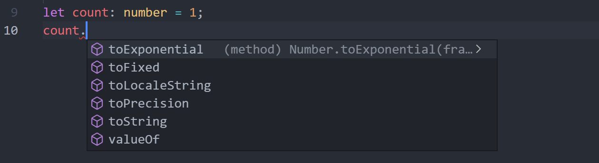
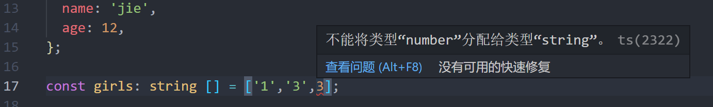
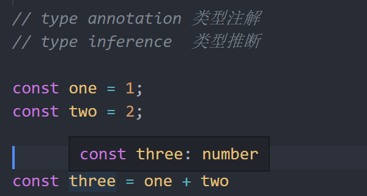

# TypeScript

* 可以给变量声明类型

~~~typescript
let count: number = 1;
count = 'd' //不能将类型“string”分配给类型“number”。ts(2322)
count = 2   //成功
~~~

* 变量会继承定义类型的方法



* 对象类型

  * 普通对象

    ```typescript
    const girl: {
      name: string;
      age: number;
    } = {
      name: 'jie',
      age: 12,
    };
    ```

    

  * 数组类型

    

  * 类（class） 类型

    ~~~typescript
    class Person {}
    const jack: Person = new Person();
    ~~~

  * 函数类型

    ~~~typescript
    const xinJack: () => string = () => {
      return 'return string';
    };
    ~~~

* 类型推断，类型注解

  * 变量简单的时候不用添加类型注解

    

    ~~~typescript
    function getTotal(one: number, two: number) {
      return one + two;
    }
    const total = getTotal(1, 2);
    // console.log(total);
    
    
    ~~~

> 如果TS能够自动分析变量类型，就不用我们手动添加
>
> ~~~typescript
> const boy = {
>   name: 'Michael',
>   age: 18,
> };
> ~~~
>
> 如果TS无法自动分析变量类型， 我们就必须要使用类型注解
>
> ~~~typescript
> function getTotal(one: number, two: number) {
>   return one + two;
> }
> const total = getTotal(1, 2);
> // console.log(total);
> ~~~


