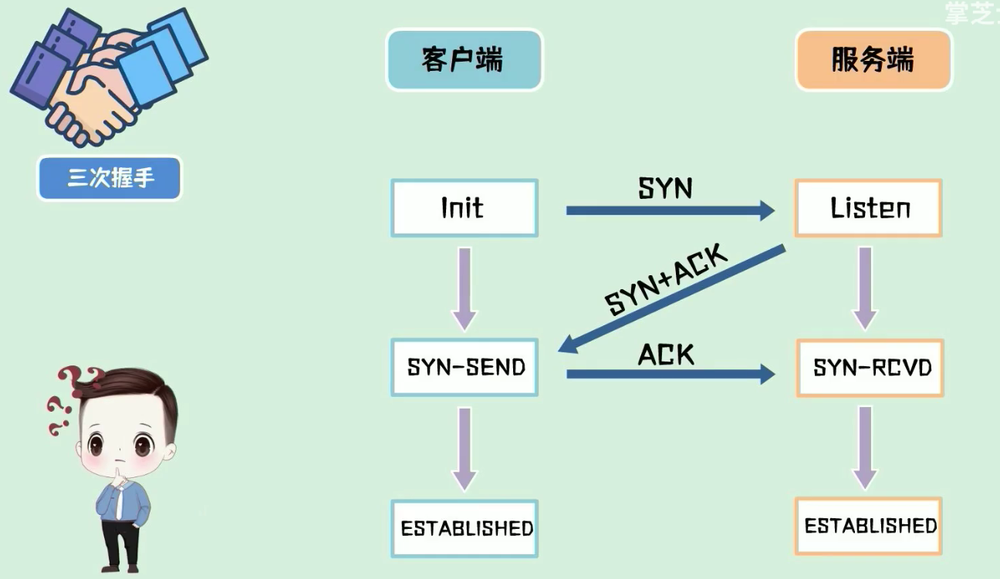
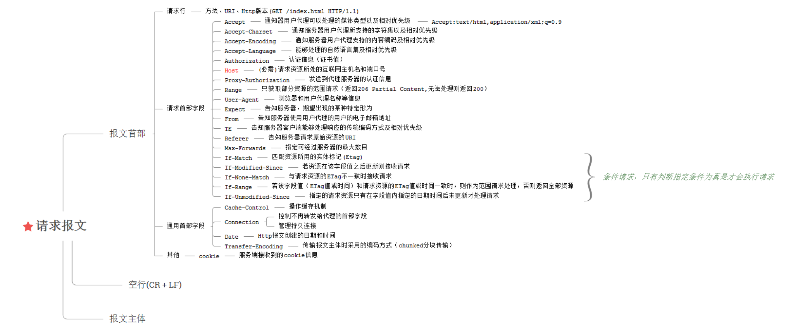
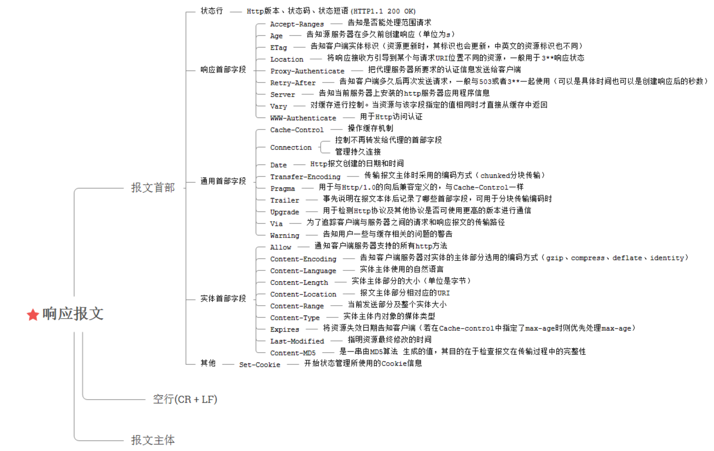
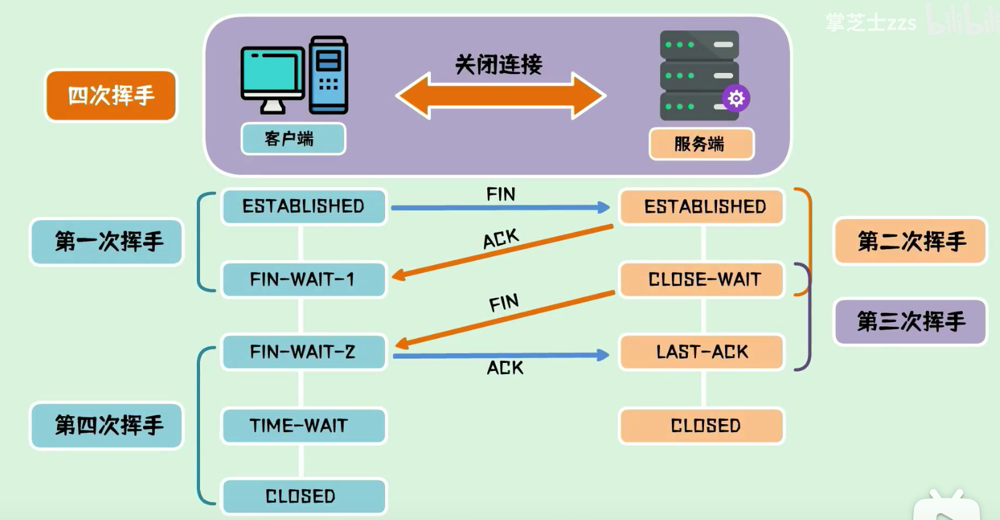

# 网络

## 1. URL输入到页面展现的简单步骤

1. DNS 解析:将域名解析成 IP 地址

   1. 在浏览器DNS缓存中搜索
   2. 在操作系统DNS缓存中搜索
   3. 读取系统hosts文件，查找其中是否有对应的ip
   4. 向本地配置的首选DNS服务器发起域名解析请求

2. TCP 连接：TCP 三次握手

   1. 为了准确地传输数据，TCP协议采用了三次握手策略。

   2. 发送端首先发送一个带`SYN`（synchronize）标志的数据包给接收方，

   3. 接收方收到后，回传一个带有`SYN/ACK`(acknowledegment)标志的数据包以示传达确认信息。

   4. 最后发送方再回传一个带`ACK`标志的数据包，代表握手结束。

   5. 在这过程中若出现问题中断，TCP会再次发送相同的数据包。

   6. TCP是一个端到端的可靠的面向连接的协议，所以HTTP基于传输层TCP协议不用担心数据的传输的各种问题。

      

3. 发送 HTTP 请求

   * 请求方法：
     - GET:获取资源
     - POST:传输实体主体
     - HEAD:获取报文首部
     - PUT:传输文件
     - DELETE:删除文件
     - OPTIONS:询问支持的方法
     - TRACE:追踪路径

   

4. 服务器处理请求并返回 HTTP 报文

   * 状态码：
     - 1**：信息性状态码
     - 2**：成功状态码
        200：OK 请求正常处理
        204：No Content请求处理成功，但没有资源可返回
        206：Partial Content对资源的某一部分的请求
     - 3**：重定向状态码
        301：Moved Permanently 永久重定向
        302：Found 临时性重定向
        304：Not Modified 缓存中读取
     - 4**：客户端错误状态码
        400：Bad Request 请求报文中存在语法错误
        401：Unauthorized需要有通过Http认证的认证信息
        403：Forbidden访问被拒绝
        404：Not Found无法找到请求资源
     - 5**：服务器错误状态码
        500：Internal Server Error 服务器端在执行时发生错误
        503：Service Unavailable 服务器处于超负载或者正在进行停机维护
   * 响应报文：

   

5. 浏览器解析html

   浏览器按顺序解析html文件，构建DOM树，在解析到外部的css和js文件时，向服务器发起请求下载资源，若是下载css文件，则解析器会在下载的同时继续解析后面的html来构建DOM树，则在下载js文件和执行它时，解析器会停止对html的解析。这便出现了js阻塞问题。
    **预加载器**：
    当浏览器被脚本文件阻塞时，预加载器（一个轻量级的解析器）会继续解析后面的html，寻找需要下载的资源。如果发现有需要下载的资源，预加载器在开始接收这些资源。预加载器只能检索HTML标签中的URL，无法检测到使用脚本添加的URL，这些资源要等脚本代码执行时才会获取。
    注: 预解析并不改变Dom树，它将这个工作留给主解析过程

   浏览器解析css，形成CSSOM树，当DOM树构建完成后，浏览器引擎通过DOM树和CSSOM树构造出渲染树。渲染树中包含可视节点的样式信息（不可见节点将不会被添加到渲染树中，如：head元素和display值为none的元素）

   > 值得注意的是，这个过程是逐步完成的，为了更好的用户体验，渲染引擎将会尽可能早的将内容呈现到屏幕上，并不会等到所有的html都解析完成之后再去构建和布局render树。它是解析完一部分内容就显示一部分内容，同时，可能还在通过网络下载其余内容。

6. 浏览器解析渲染页面

   - 布局：通过计算得到每个渲染对象在可视区域中的具体位置信息（大小和位置），这是一个递归的过程。
   - 绘制：将计算好的每个像素点信息绘制在屏幕上

   在页面显示的过程中会多次进行Reflow和Repaint操作，而Reflow的成本比Repaint的成本高得多的多。因为Repaint只是将某个部分进行重新绘制而不用改变页面的布局，如：改变了某个元素的背景颜色。而如果将元素的display属性由block改为none则需要Reflow。

   

7. 断开连接：TCP 四次挥手

   * TCP 的连接的拆除需要发送四个包，因此称为[四次挥手](http://coding.imooc.com/class/101.html)(Four-way handshake)，也叫做改进的三次握手。客户端或服务器均可主动发起挥手动作，在 socket 编程中，任何一方执行 close() 操作即可产生挥手操作。
   * 第一次挥手(FIN=1，seq=x)
     假设客户端想要关闭连接，客户端发送一个` FIN `标志位置为1的包，表示自己已经没有数据可以发送了，但是仍然可以接受数据。发送完毕后，客户端进入` FIN_WAIT_1 `状态。
   * 第二次挥手(ACK=1，ACKnum=x+1)
     服务器端确认客户端的 FIN 包，发送一个`ACK`包确认，表明自己接受到了客户端关闭连接的请求，但还没有准备好关闭连接。发送完毕后，服务器端进入 `CLOSE_WAIT` 状态，客户端接收到这个确认包(ACK)之后，进入 `FIN_WAIT_2` 状态，等待服务器端关闭连接。
   * 第三次挥手(FIN=1，seq=y)
     服务器端准备好关闭连接时，向客户端发送`FIN`包结束连接请求，FIN 置为1。
     发送完毕后，服务器端进入 `LAST_ACK` 状态，等待来自客户端的最后一个ACK。
   * 第四次挥手(ACK=1，ACKnum=y+1)
     客户端接收到来自服务器端的关闭请求，发送一个`ACK`确认包，并进入` TIME_WAIT`状态，等待可能出现的要求重传的 ACK 包。服务器端接收到这个确认包之后，关闭连接，进入` CLOSED `状态。客户端等待了某个固定时间（两个最大段生命周期，2MSL，2 Maximum Segment Lifetime）之后，没有收到服务器端的 ACK ，认为服务器端已经正常关闭连接，于是自己也关闭连接，进入 CLOSED 状态。
   * 


## 2. http和https

### 1. http和https的基本概念

http: 超文本传输协议，是互联网上应用最为广泛的一种网络协议，是一个客户端和服务器端请求和应答的标准（TCP），用于从WWW服务器传输超文本到本地浏览器的传输协议，它可以使浏览器更加高效，使网络传输减少。

https: 是以安全为目标的HTTP通道，简单讲是HTTP的安全版，即HTTP下加入SSL层，HTTPS的安全基础是SSL，因此加密的详细内容就需要SSL。

https协议的主要作用是：建立一个信息安全通道，来确保数组的传输，确保网站的真实性。

### 2. http和https的区别？

http传输的数据都是`未加密`的，也就是明文的，网景公司设置了`SSL协议`来对http协议传输的数据进行加密处理，简单来说https协议是由http和ssl协议构建的可进行加密传输和身份认证的网络协议，比http协议的安全性更高。
主要的区别如下：

Https协议`需要ca证书`，费用较高。

http是超文本传输协议，信息是明文传输，https则是具有安全性的`ssl加密传输协议`。

使用不同的链接方式，端口也不同，一般而言，http协议的端口为80，https的端口为443

http的连接很简单，是无状态的；HTTPS协议是由SSL+HTTP协议构建的可进行加密传输、身份认证的网络协议，比http协议安全。

### 3. https协议的工作原理

客户端在使用HTTPS方式与Web服务器通信时有以下几个步骤，如图所示。

客户使用https url访问服务器，则要求web 服务器建立ssl链接。

web服务器接收到客户端的请求之后，会将网站的证书（证书中包含了公钥），返回或者说传输给客户端。

客户端和web服务器端开始协商SSL链接的安全等级，也就是加密等级。

客户端浏览器通过双方协商一致的安全等级，建立会话密钥，然后通过网站的公钥来加密会话密钥，并传送给网站。

web服务器通过自己的私钥解密出会话密钥。

web服务器通过会话密钥加密与客户端之间的通信。

### 4. https协议的优点

使用HTTPS协议可认证用户和服务器，确保数据发送到正确的客户机和服务器；

HTTPS协议是由SSL+HTTP协议构建的可进行加密传输、身份认证的网络协议，要比http协议安全，可防止数据在传输过程中不被窃取、改变，确保数据的完整性。

HTTPS是现行架构下最安全的解决方案，虽然不是绝对安全，但它大幅增加了中间人攻击的成本。

谷歌曾在2014年8月份调整搜索引擎算法，并称“比起同等HTTP网站，采用HTTPS加密的网站在搜索结果中的排名将会更高”。

### 5. https协议的缺点

https握手阶段比较费时，会使页面加载时间延长50%，增加10%~20%的耗电。

https缓存不如http高效，会增加数据开销。

SSL证书也需要钱，功能越强大的证书费用越高。

SSL证书需要绑定IP，不能再同一个ip上绑定多个域名，ipv4资源支持不了这种消耗。


##  3. TCP和UDP的区别

1. TCP是面向连接的，udp是无连接的即发送数据前不需要先建立链接。

2. TCP提供可靠的服务。也就是说，通过TCP连接传送的数据，无差错，不丢失，不重复，且按序到达;UDP尽最大努力交付，即不保证可靠交付。 并且因为tcp可靠，面向连接，不会丢失数据因此适合大数据量的交换。

3. TCP是面向字节流，UDP面向报文，并且网络出现拥塞不会使得发送速率降低（因此会出现丢包，对实时的应用比如IP电话和视频会议等）。

4. TCP只能是1对1的，UDP支持1对1,1对多。

5. TCP的首部较大为20字节，而UDP只有8字节。

6. TCP是面向连接的可靠性传输，而UDP是不可靠的。

## 4. WebSocket

### 1. 什么是WebSocket?

WebSocket是HTML5中的协议，支持持久连续，http协议不支持持久性连接。Http1.0和HTTP1.1都不支持持久性的链接，HTTP1.1中的keep-alive，将多个http请求合并为1个

### 2. WebSocket是什么样的协议，具体有什么优点？

HTTP的生命周期通过Request来界定，也就是Request一个Response，那么在Http1.0协议中，这次Http请求就结束了。在Http1.1中进行了改进，是的有一个connection：Keep-alive，也就是说，在一个Http连接中，可以发送多个Request，接收多个Response。但是必须记住，在Http中一个Request只能对应有一个Response，而且这个Response是被动的，不能主动发起。

WebSocket是基于Http协议的，或者说借用了Http协议来完成一部分握手，在握手阶段与Http是相同的。一个websocket握手协议的实现，基本是2个属性，upgrade，connection。

##  5 .强，协商缓存

缓存分为两种：强缓存和协商缓存，根据响应的header内容来决定。

|          | 获取资源形式 | 状态码              | 发送请求到服务器                 |
| -------- | ------------ | ------------------- | -------------------------------- |
| 强缓存   | 从缓存取     | 200（from cache）   | 否，直接从缓存取                 |
| 协商缓存 | 从缓存取     | 304（not modified） | 是，通过服务器来告知缓存是否可用 |

强缓存相关字段有expires，cache-control。如果cache-control与expires同时存在的话，cache-control的优先级高于expires。

协商缓存相关字段有Last-Modified/If-Modified-Since，Etag/If-None-Match


## 6. 说一下http2.0

简要概括：http2.0是基于1999年发布的http1.0之后的首次更新。

提升访问速度（可以对于，请求资源所需时间更少，访问速度更快，相比http1.0）

允许多路复用：多路复用允许同时通过单一的HTTP/2连接发送多重请求-响应信息。改善了：在http1.1中，浏览器客户端在同一时间，针对同一域名下的请求有一定数量限制（连接数量），超过限制会被阻塞。

二进制分帧：HTTP2.0会将所有的传输信息分割为更小的信息或者帧，并对他们进行二进制编码

首部压缩

服务器端推送

##  7. fetch发送2次请求的原因

> 为什么fetch发送post请求的时候，总是发送2次，第一次状态码是204，第二次才成功？

答：因为你用fetch的post请求的时候，导致fetch 第一次发送了一个Options请求，询问服务器是否支持修改的请求头，如果服务器支持，则在第二次中发送真正的请求。


## 8. Cookie、sessionStorage、localStorage的区别

* cookie数据始终在同源的http请求中携带(即使不需要)，即cookie在浏览器和服务器间来回传递
* cookie数据还有路径（path）的概念，可以限制。cookie只属于某个路径下
* 存储大小限制也不同，cookie数据不能超过4K，同时因为每次http请求都会携带cookie，所以cookie只适合保存很小的数据，如回话标识。
* webStorage虽然也有存储大小的限制，但是比cookie大得多，可以达到5M或更大
* 数据的有效期不同
  * sessionStorage：仅在当前的浏览器窗口关闭有效；
  * localStorage：始终有效，窗口或浏览器关闭也一直保存，因此用作持久数据；
  * cookie：只在设置的cookie过期时间之前一直有效，即使窗口和浏览器关闭
* 作用域不同
  * sessionStorage：不在不同的浏览器窗口中共享，即使是同一个页面；
  * localStorage：在所有同源窗口都是共享的；
  * cookie：也是在所有同源窗口中共享的


##  9. cookie session区别

1.  cookie数据存放在客户的浏览器上，session数据放在服务器上。

2. cookie不是很安全，别人可以分析存放在本地的COOKIE并进行COOKIE欺骗
   考虑到安全应当使用session。

3. session会在一定时间内保存在服务器上。当访问增多，会比较占用你服务器的性能
   考虑到减轻服务器性能方面，应当使用COOKIE。

4. 单个cookie保存的数据不能超过4K，很多浏览器都限制一个站点最多保存20个cookie。

## 10. Doctype作用?严格模式与混杂模式如何区分？它们有何意义?

Doctype声明于文档最前面，告诉浏览器以何种方式来渲染页面，这里有两种模式，严格模式和混杂模式。

严格模式的排版和JS 运作模式是 以该浏览器支持的最高标准运行。

混杂模式，`向后兼容`，模拟老式浏览器，防止浏览器无法兼容页面。


## 11. 介绍知道的http返回的状态码

`100`  Continue  继续。客户端应继续其请求

`101`  Switching Protocols  切换协议。服务器根据客户端的请求切换协议。只能切换到更高级的协议，例如，切换到HTTP的新版本协议

`200 ` OK  请求成功。一般用于GET与POST请求

`201`  Created  已创建。成功请求并创建了新的资源

`202`  Accepted  已接受。已经接受请求，但未处理完成

`203`  Non-Authoritative Information  非授权信息。请求成功。但返回的meta信息不在原始的服务器，而是一个副本

`204 ` No Content  无内容。服务器成功处理，但未返回内容。在未更新网页的情况下，可确保浏览器继续显示当前文档

`205`  Reset Content  重置内容。服务器处理成功，用户终端（例如：浏览器）应重置文档视图。可通过此返回码清除浏览器的表单域

`206`  Partial Content  部分内容。服务器成功处理了部分GET请求

`300`  Multiple Choices  多种选择。请求的资源可包括多个位置，相应可返回一个资源特征与地址的列表用于用户终端（例如：浏览器）选择

`301`  Moved Permanently  永久移动。请求的资源已被永久的移动到新URI，返回信息会包括新的URI，浏览器会自动定向到新URI。今后任何新的请求都应使用新的URI代替

`302`  Found  临时移动。与301类似。但资源只是临时被移动。客户端应继续使用原有URI

`303`  See Other  查看其它地址。与301类似。使用GET和POST请求查看

`304`  Not Modified  未修改。所请求的资源未修改，服务器返回此状态码时，不会返回任何资源。客户端通常会缓存访问过的资源，通过提供一个头信息指出客户端希望只返回在指定日期之后修改的资源

`305`  Use Proxy  使用代理。所请求的资源必须通过代理访问

`306`  Unused  已经被废弃的HTTP状态码

`307`  Temporary Redirect  临时重定向。与302类似。使用GET请求重定向

`400 ` Bad Request  客户端请求的语法错误，服务器无法理解

`401 ` Unauthorized  请求要求用户的身份认证

`402`  Payment Required  保留，将来使用

`403 ` Forbidden  服务器理解请求客户端的请求，但是拒绝执行此请求

`404 ` Not Found  服务器无法根据客户端的请求找到资源（网页）。通过此代码，网站设计人员可设置"您所请求的资源无法找到"的个性页面

`405`  Method Not Allowed  客户端请求中的方法被禁止

`406`  Not Acceptable  服务器无法根据客户端请求的内容特性完成请求

`407`  Proxy Authentication Required  请求要求代理的身份认证，与401类似，但请求者应当使用代理进行授权

`408`  Request Time-out  服务器等待客户端发送的请求时间过长，超时

`409`  Conflict  服务器完成客户端的PUT请求是可能返回此代码，服务器处理请求时发生了冲突

`410 ` Gone  客户端请求的资源已经不存在。410不同于404，如果资源以前有现在被永久删除了可使用410代码，网站设计人员可通过301代码指定资源的新位置

`411`  Length Required  服务器无法处理客户端发送的不带Content-Length的请求信息

`412`  Precondition Failed  客户端请求信息的先决条件错误

`413`  Request Entity Too Large  由于请求的实体过大，服务器无法处理，因此拒绝请求。为防止客户端的连续请求，服务器可能会关闭连接。如果只是服务器暂时无法处理，则会包含一个Retry-After的响应信息

`414`  Request-URI Too Large  请求的URI过长（URI通常为网址），服务器无法处理

`415`  Unsupported Media Type  服务器无法处理请求附带的媒体格式

`416`  Requested range not satisfiable  客户端请求的范围无效

`417`  Expectation Failed  服务器无法满足Expect的请求头信息

`500`  Internal Server Error  服务器内部错误，无法完成请求

`501`  Not Implemented  服务器不支持请求的功能，无法完成请求

`502`  Bad Gateway  作为网关或者代理工作的服务器尝试执行请求时，从远程服务器接收到了一个无效的响应

`503`  Service Unavailable  由于超载或系统维护，服务器暂时的无法处理客户端的请求。延时的长度可包含在服务器的Retry-After头信息中

`504 ` Gateway Time-out  充当网关或代理的服务器，未及时从远端服务器获取请求

`505`  HTTP Version not supported  服务器不支持请求的HTTP协议的版本，无法完成处理


# HTML

## 1. 说一下HTML5 drag api

`dragstart`：事件主体是被拖放元素，在开始拖放被拖放元素时触发。

`darg`：事件主体是被拖放元素，在正在拖放被拖放元素时触发。

`dragenter`：事件主体是目标元素，在被拖放元素进入某元素时触发。

`dragover`：事件主体是目标元素，在被拖放在某元素内移动时触发。

`dragleave`：事件主体是目标元素，在被拖放元素移出目标元素是触发。

`drop`：事件主体是目标元素，在目标元素完全接受被拖放元素时触发。

`dragend`：事件主体是被拖放元素，在整个拖放操作结束时触发


## 2. HTML5有哪些新特性、移除了那些元素？

`HTML5`现在已经不是 `SGML` 的子集，主要是关于图像，位置，存储，多任务等功能的增加

- 绘画 `canvas`
- 用于媒介回放的 `video` 和 `audio` 元素
- 本地离线存储 `localStorage` 长期存储数据，浏览器关闭后数据不丢失
- `sessionStorage` 的数据在浏览器关闭后自动删除
- 语意化更好的内容元素，比如`article`、`footer`、`header`、`nav`、`section`
- 表单控件，`calendar`、`date`、`time`、`email`、`url`、`search`
- 新的技术`webworker`、 `websocket`、 `Geolocation`

**移除的元素**：

- 纯表现的元素：`basefont`、`big`、`center`、`font`、`s`、`strike`、 `tt、u`
- 对可用性产生负面影响的元素：`frame`、`frameset`、`noframes`

**支持`HTML5`新标签**：

- `IE8/IE7/IE6`支持通过`document.createElement`方法产生的标签
- 可以利用这一特性让这些浏览器支持`HTML5`新标签
- 浏览器支持新标签后，还需要添加标签默认的样式
- 当然也可以直接使用成熟的框架、比如`html5shim`

## 3. HTML全局属性(global attribute)有哪些

- `class`:为元素设置类标识
- `data-*`: 为元素增加自定义属性
- `draggable`: 设置元素是否可拖拽
- `id`: 元素id，文档内唯一
- `lang`: 元素内容的的语言
- `style`: 行内css样式
- `title`: 元素相关的建议信息

## 4. 行内元素有哪些？块级元素有哪些？空(void)元素有那些？行内元素和块级元素有什么区别？

- 行内元素有：`a b span img input select strong`
- 块级元素有：`div ul ol li dl dt dd h1 h2 h3 h4… p`
- 空元素：`<br> <hr>  <input> <link> <meta>`
- 行内元素不可以设置宽高，不独占一行
- 块级元素可以设置宽高，独占一行


# CSS

## 1. 如何画一条0.5px的线

### 1. 采用meta viewport的方式

~~~html
<meta name="viewport" content="width=device-width, initial-scale=0.5, minimum-scale=0.5, maximum-scale=0.5"/>
~~~

这样子就能缩放到原来的0.5倍，如果是1px那么就会变成0.5px

要记得`viewport`只针对于`移动端`，只在移动端上才能看到效果

### 2. 采用transform: scale()的方式

~~~css
transform: scale(0.5,0.5);
~~~

## 2.对 BFC 规范（块级格式化上下文：blockformattingcontext）的理解？

块格式化上下文（BlockFormattingContext，BFC）是Web页面的可视化CSS渲染的一部分，是布局过程中生成块级盒子的区域，也是浮动元素与其他元素的交互限定区域。

通俗来讲

* BFC是一个独立的布局环境，可以理解为一个容器，在这个容器中按照一定规则进行物品摆放，并且不会影响其它环境中的物品。
* 如果一个元素符合触发BFC的条件，则BFC中的元素布局不受外部影响。

> 创建BFC
>
> （1）根元素或包含根元素的元素
> （2）浮动元素float＝left|right或inherit（≠none）
> （3）绝对定位元素position＝absolute或fixed
> （4）display＝inline-block|flex|inline-flex|table-cell或table-caption
> （5）overflow＝hidden|auto或scroll(≠visible)


## 3. link与@import的区别

- `link`是`HTML`方式，`@import`是`CSS`方式
- `link`最大限度支持并行下载，`@import`过多嵌套导致串行下载，出现`FOUC`(文档样式短暂失效)
- `link`可以通过`rel="alternate stylesheet"`指定候选样式
- 浏览器对link支持早于`@import`，可以使用`@import`对老浏览器隐藏样式
- `@import`必须在样式规则之前，可以在`css`文件中引用其他文件
- 总体来说：`link`优于`@import`


## 4. ::before 和:after 中双冒号和单冒号有什么区别？解释一下这 2 个伪元素的作用

> 单冒号（:）用于CSS3`伪类`，双冒号（::）用于CSS3`伪元素`。（伪元素由双冒号和伪元素名称组成）
> 双冒号是在当前规范中引入的，`用于区分伪类和伪元素`。不过浏览器需要同时支持旧的已经存在的伪元素写法，
> 比如:first-line、:first-letter、:before、:after等，
> 而新的在CSS3中引入的伪元素则不允许再支持旧的单冒号的写法。

> 想让插入的内容出现在其它内容前，使用::before，否者，使用::after；
> 在代码顺序上，::after生成的内容也比::before生成的内容靠后。
> 如果按堆栈视角，::after生成的内容会在::before生成的内容之上。

在css3中使用单冒号来表示伪类，用双冒号来表示伪元素。但是为了兼容已有的伪元素的写法，在一些浏览器中也可以使用单冒号来表示伪元素。

伪类一般匹配的是元素的一些特殊状态，如hover、link等，而伪元素一般匹配的特殊的位置，比如after、before等。

## 5. 一般常见的几种居中的方法有：

>对于宽高固定的元素
>
>（1）我们可以利用margin:0auto来实现元素的水平居中。
>
>（2）利用绝对定位，设置四个方向的值都为0，并将margin设置为auto，由于宽高固定，因此对应方向实现平分，可以实现水平和垂直方向上的居中。
>
>（3）利用绝对定位，先将元素的左上角通过top:50%和left:50%定位到页面的中心，然后再通过margin负值来调整元素的中心点到页面的中心。
>
>（4）利用绝对定位，先将元素的左上角通过top:50%和left:50%定位到页面的中心，然后再通过translate来调整元素的中心点到页面的中心。
>
>（5）使用flex布局，通过align-items:center和justify-content:center设置容器的垂直和水平方向上为居中对
>齐，然后它的子元素也可以实现垂直和水平的居中。
>
>对于宽高不定的元素，上面的`后面两种方法`，可以实现元素的垂直和水平的居中。

## 6. position 的值 relative 和 absolute 定位原点是？

> relative定位的元素，是相对于`元素本身`的正常位置来进行定位的。
>
> absolute定位的元素，是相对于它的第一个position值不为static的祖先元素的`paddingbox`来进行定位的。
>
> 生成绝对定位的元素，相对于值不为static的第一个父元素的paddingbox进行定位，
>
> 也可以理解为离自己这一级元素`最近的一级`position设置为`absolute`或者`relative`的父元素的paddingbox的`左上角`为原点的。。

### absolute
生成绝对定位的元素，相对于值不为static的第一个父元素的paddingbox进行定位，

也可以理解为离自己这一级元素`最近的一级`position设置为`absolute`或者`relative`的父元素的paddingbox的`左上角`为原点的。

### fixed（老IE不支持）
生成绝对定位的元素，相对于浏览器窗口进行定位。

### relative

生成相对定位的元素，相对于其元素本身所在正常位置进行定位。

### static
默认值。没有定位，元素出现在正常的流中（忽略top,bottom,left,right,z-index声明）。

### inherit
规定从父元素继承position属性的值。


## 7. CSS 里的 visibility 属性有个 collapse 属性值是干嘛用的？在不同浏览器下以后什么区别？

1. 对于一般的元素，它的表现跟visibility：hidden;是一样的。元素是不可见的，但此时仍占用页面空间。

2. 但例外的是，如果这个元素是table相关的元素，例如table行，tablegroup，table列，tablecolumngroup，它的表现却跟display:none一样，也就是说，它们占用的空间也会释放。

* 在不同浏览器下的区别：
  * 在谷歌浏览器里，使用collapse值和使用hidden值没有什么区别。
  * 在火狐浏览器、Opera和IE11里，使用collapse值的效果就如它的字面意思：table的行会消失，它的下面一行会补充它的位置。


## 8.绝对定位元素与非绝对定位元素的百分比计算的区别

```
绝对定位元素的宽高百分比是相对于临近的position不为static的祖先元素的paddingbox来计算的。

非绝对定位元素的宽高百分比则是相对于父元素的contentbox来计算的。
```


## 9. 简单介绍使用图片 base64 编码的优点和缺点。

base64编码是一种图片处理格式，通过特定的算法将图片编码成一长串字符串，在页面上显示的时候，可以用该字符串来`代替图片的url`属性。

* 使用base64的优点是：
  * 减少一个图片的HTTP请求

* 使用base64的缺点是：
  * 根据base64的编码原理，编码后的大小会比原文件大小大1/3，如果把大图片编码到html/css中，不仅会造成文件体积的增加，影响文件的加载速度，还会增加浏览器对html或css文件解析渲染的时间。
  * 使用base64无法直接缓存，要缓存只能缓存包含base64的文件，比如HTML或者CSS，这相比域直接缓存图片的效果要差很多。
  * 兼容性的问题，ie8以前的浏览器不支持。

一般一些网站的`小图标`可以使用base64图片来引入


# js

## BOM属性对象方法

### 1. location对象

location.href-- 返回或设置当前文档的URL
location.search -- 返回URL中的查询字符串部分。例如 http://www.dreamdu.com/dreamdu.php?id=5&name=dreamdu 返回包括(?)后面的内容?id=5&name=dreamdu
location.hash -- 返回URL#后面的内容，如果没有#，返回空
location.host -- 返回URL中的域名部分，例如[www.dreamdu.com](http://www.dreamdu.com/)
location.hostname -- 返回URL中的主域名部分，例如dreamdu.com
location.pathname -- 返回URL的域名后的部分。例如 http://www.dreamdu.com/xhtml/ 返回/xhtml/
location.port -- 返回URL中的端口部分。例如 http://www.dreamdu.com:8080/xhtml/ 返回8080
location.protocol -- 返回URL中的协议部分。例如 http://www.dreamdu.com:8080/xhtml/ 返回(//)前面的内容http:
location.assign -- 设置当前文档的URL
location.replace() -- 设置当前文档的URL，并且在history对象的地址列表中移除这个URL location.replace(url);
location.reload() -- 重载当前页面

### 2.history对象

history.go() -- 前进或后退指定的页面数 history.go(num);
history.back() -- 后退一页
history.forward() -- 前进一页

### 3. Navigator对象

navigator.userAgent -- 返回用户代理头的字符串表示(就是包括浏览器版本信息等的字符串)
navigator.cookieEnabled -- 返回浏览器是否支持(启用)cookie

##  1、数组扁平化

```
const arr = [1, [2, [3, [4, 5]]], 6];
```

#### 方法一：flat()
>
> ```js
> const res1 = arr.flat(Infinity);
> console.log('1',res1)
> ```
>
> // ==>> [1, 2, 3, 4, 5, 6]
>
> // ==>> [1, 2, 3, 4, 5, 6]

#### 方法二:利用正则
>
> ```js
> const res2 = JSON.stringify(arr).replace(/\[|\]/g, '').split(',');
> console.log('2',res2)
> ```
>
> // ==>> ["1", "2", "3", "4", "5", "6"],`数据类型都会变成字符串`
>
> // ==>> ["1", "2", "3", "4", "5", "6"],`数据类型都会变成字符串`

#### 方法三:正则改良
>
> ```js
> const res3 = JSON.parse('[' + JSON.stringify(arr).replace(/\[|\]/g, '') + ']');
> console.log('3',res3)
> ```
>
> // ==>> [1, 2, 3, 4, 5, 6]
>
> // ==>> [1, 2, 3, 4, 5, 6]

#### 方法四:使用reduce
>
> ```js
> const flatten = arr => {
> 	return arr.reduce((pre, cur) => {
> 		return pre.concat(Array.isArray(cur) ? flatten(cur) : cur);
> 	}, [])
> }
> const res4 = flatten(arr);
> console.log('4',res4)
> ```
>
> 

#### 方法五:函数递归
>
> ```js
> const res5 = [];
> const fn = arr => {
> 	for (let i = 0, j = arr.length; i < j; i++) {
> 		if (Array.isArray(arr[i])) {
> 			fn(arr[i])
> 		} else {
> 			res5.push(arr[i])
> 		}
> 	}
> 	return res5
> }
> fn(arr)
> console.log('5',res5)
> ```
>
> 


## 2、 数组去重

```
const arr = [1,1,'1',17,true,true,false,false,'true','a',{},{}];
```

```
====> [1,'1',17,true,false,'true','a',{},{}] 
```

#### 方法一:利用set
> ```js
> const res1 = Array.from(new Set(arr));
> console.log("res1:",res1);
> ```

#### 方法二:两层for循环+splice
> ```js
> const unique1 = arr => {
> 	let len = arr.length;
> 	for(let i = 0;i<len;i++){
> 		for(let j = i + 1;j < len;j++){
> 			if (arr[i] === arr[j] ){
> 				arr.splice(j,1);
> 				len--;
> 				j--;
> 			}
> 		}
> 	}
> 	return arr;
> }
> let res2 = unique1(arr)
> console.log("res2:",res2);
> ```

#### 方法三利用indexOf
>
> ```js
> const unique2 = arr =>{
> 	const res = [];
> 	for (let i = 0,j = arr.length;i < j;i++){
> 		if(res.indexOf(arr[i]) === -1) res.push(arr[i]);
> 	}
> 	return res;
> }
> let res3 = unique2(arr)
> console.log("res3:",res3)
> ```
>
> 

#### 方法四:利用include
>
> ```js
> const unique3 = arr =>{
> 	const res = [];
> 	for(let i=0,j = arr.length;i<j;i++){
> 		if(!res.includes(arr[i])) res.push(arr[i]);
> 	}
> 	return res;
> }
> 
> let res4 = unique3(arr)
> console.log("res4:",res4)
> ```
>
> 

#### 方法五：利用filter
> ```js
> const unique4 = arr =>{
> 	return arr.filter((item,index) =>{
> 		return arr.indexOf(item) === index;
> 	});
> }
> let res5 = unique4(arr)
> console.log("res5:",res5)
> ```
>
> 

#### 方法六：利用Map

>
> ```js
> const unique5 = arr =>{
> 	const map = new Map();
> 	const res = [];
> 	for(let i = 0,j = arr.length;i < j; i++){
> 		if(!map.has(arr[i])){
> 			map.set(arr[i],true)
> 			res.push(arr[i]);
> 		}
> 	}
> 	return res;
> }
> let res6 = unique5(arr)
> console.log("res6:",res6)
> ```

## 3、 类数组转化为数组

类数组是具有length属性，但不具有数组原型上的方法

常见的类数组有arguments、DOM操作方法返回的结果

### 方法一: Array.from

```js
Array.from(document.queryselectorAl1 ( 'div ' ))
```

### 方法二:Array.prototype.slice.call

```js
Array.prototype.slice.call(document.queryselectorAll ( 'div'))
```

### 方法三:扩展运算符

~~~js
[ ...document.querySelectorAll( 'div')]
~~~

### 方法四:利用concat

~~~js
Array.prototype.concat.apply([],document.querySelectorAll( 'div'));
~~~


## 4.什么是函数柯里化？

是把`接受多个参数`的函数变换成`接受一个`单一参数（最初函数的第一个参数）的`函数`，

并且返回(`接受余下的参数而且返回结果的新函数`)的技术。

把接受多个参数的函数转换成接受一个单一参数的函数

```js
// 普通方法
var add = function(x, y) {
    return x + y;
}    
add(3, 4)       //7

// 柯里化
var foo = function(x) {
    return function(y) {
        return x + y
    }
}    
foo(3)(4)       // 7    
```

## 5.什么是Promise对象，有哪些用法

### Promise对象的定义
Promise是异步编程的一种解决方案，它是一个容器，里面保存着某个未来才会结束的事件（通常是一个异步操作）的结果。从语法上说，Promise
是一个对象，从它可以获取异步操作的消息。可以用来解决“回调地狱”的问题。Promise 提供统一的
API，各种异步操作都可以用同样的方法进行处理。promise对象是一个构造函数，用来生成Promise实例； 

### Promise对象的特点
1. 对象的状态不受外界影响，promise对象代表一个异步操作，有三种状态，`pending`（进行中）、`fulfilled`（已成功）、`rejected`（已失败）。

   只有异步操作的结果，可以决定当前是哪一种状态，任何其他操作都无法改变这个状态，这也是promise这个名字的由来“承诺”；

2. 一旦状态改变就不会再变，任何时候都可以得到这个结果，
3. promise对象的状态改变，只有两种可能：从`pending变为fulfilled`，从`pending变为rejected`。这时就称为`resolved`（已定型）。如果改变已经发生了，你再对promise对象添加回调函数，也会立即得到这个结果，这与事件（event）完全不同，事件的特点是：`如果你错过了它，再去监听是得不到结果`的。

有了Promise对象，就可以将异步操作以同步操作的流程表达出来，避免了层层嵌套的回调函数。此外，Promise对象提供统一的接口，使得控制异步操作更加容易。

### Promise也有一些缺点。

* 首先，无法取消Promise，一旦新建它就会立即执行，无法中途取消。

* 其次，如果不设置回调函数，Promise内部抛出的错误，不会反应到外部。

* 第三，当处于pending状态时，无法得知目前进展到哪一个阶段（刚刚开始还是即将完成）。

### Promise对象的用法

它是一个构造函数，这个构造函数里有两个参数，分别是：`resolve`（成功之后的回调函数）、`reject`（失败之后的回调函数）。
因为promise表示的是一个异步操作，每当我们new一个promise实例，就表示一个具体的异步操作，那么这个异步操作的结果就只能有两种状态：成功/失败，两者都需要回调函数resolve/reject返回。所以内部拿到操作的结果后，无法使用return把操作结果返回给调用者，这时候只能用回调函数的形式来把成功或失败的结果返回给调用者。

promise实例生成以后，可以用then方法分别指定resolved状态和rejected状态的回调函数

then方法可以接受连个回调函数作为参数，第一个回调函数是promise对象的状态变为resolved时调用，第二个回调函数是promise对象的状态变为rejected时调用，其中，第二个函数是可选的，不一定要提供，这两个函数都接受promise对象传出的值作为参数；

## 6.什么是REST，用起来有什么好处

REST是一种`设计API的模式`。最常用的数据格式是JSON。由于JSON能直接被JavaScript读取，所以，以JSON格式编写的REST风格的API具有简单、易读、易用的特点。通过REST模式设计的API可以把web
app 全部功能进行封装，可以很容易的实现前后端分离，使的前端代码易编写，后端代码易测试。


## 7.什么是闭包，举个例子说明一下?

>
> “闭包就是能够读取其他函数内部变量的函数。
>
> 例如在javascript中，只有函数内部的子函数才能读取局部变量，
>
> 所以闭包可以理解成“定义在一个函数内部的函数“。
>
> 在本质上，闭包是将函数内部和函数外部连接起来的`桥梁`。”
> 举例：创建闭包最常见方式，就是在一个函数内部创建另一个函数。下面例子中的 closure 就是一个闭包， 
>
> ```js
> function func(){ 
>   vara =1 ,
>   b = 2; 
>   funciton closure(){ 
>     return a+b; 
>   } 
>   return closure;
> }
> ```

## 8.Async/await

很多人认为它是异步操作的最终解决方案

其实async函数就是`Generator`函数的`语法糖`，
`Generator`是`ES6`提出的异步编程解决方案，语法行为与传统函数完全不同
形式上，Generator函数是一个普通函数，
但是有两个特征，一是function关键字与函数名之间有一个星号；二是函数体内部使用`yield`表达式，
Generator 里面的代码是 分段执行 遇到`yield`就分一段

```js
function* helloworldGenerator(){
	yield 'hello'; //yield 相当于一个暂停标记
	yield 'world';
	return 'ending';
}

var hw = helloworldGenerator();//hw返回一个指针
console.log(hw)//这个函数的结果是ending吗？ 不是 因为代码是暂停的 得到的是一个暂停标记，指向hello

console.log(hw.next())//指向hello的下一步就得到hello，next才能拿出这个暂停的值
console.log(hw.next())//再下一步就拿到world
console.log(hw.next())
console.log(hw.next())//没有了就返回undefined
```

> async + await 原理就是Generator + yield


## 9.apply/call/bind ？

这三者的作用就是`改变`函数运行时`this的指向。`

### call方法：

 语法：call([thisObj[,arg1[, arg2[, [,.argN]]]]])

 定义：调用一个对象的一个方法，以另一个对象`替换当前对象。`

 说明：call方法可以用来`代替`另一个对象调用一个方法。call 方法可将一个函数的对象上下文从初始的上下文改变为由 thisObj 指定的新对象。

如果没有提供 thisObj 参数，那么 Global 对象被用作 thisObj。 

### apply方法：

语法：apply([thisObj[,argArray]]) 

定义：应用某一对象的一个方法，用另一个对象替换当前对象。 

说明：如果argArray 不是一个有效的数组或者不是 arguments 对象，那么将导致一个 TypeError。

如果没有提供 argArray 和 thisObj 任何一个参数，那么 Global 对象将被用作 thisObj， 并且无法被传递任何参数。 

### bind方法：

语法：bind(thisArg[, arg1[, arg2[, ...]]])

定义：将接受多个参数的函数变换成接受一个单一参数。
说明：bind()方法所返回的函数的length（形参数量）等于原函数的形参数量减去传入bind()方法中的实参数量（第一个参数以后的所有参数），因为传入bind中的实参都会绑定到原函数的形参。

## 10. 简单说说js中的继承?

1. `原型链继承` JavaScript实现继承的基本思想：

   通过原型将一个引用类型继承另一个引用类型的属性和方法。

2. 借用`构造函数`继承(伪造对象或经典继承) JavaScript实现继承的基本思想：

   在子类构造函数内部调用超类型构造函数。 

   通过使用apply()和call()方法可以在新创建的子类对象上执行构造函数。

3. `组合继承`(原型+借用构造)(伪经典继承) JavaScript实现继承的基本思想：

   将原型链和借用构造函数的技术组合在一块，从而发挥两者之长的一种继承模式。
   将原型链和借用构造函数的技术组合到一起，从而取长补短发挥两者长处的一种继承模式。

4. `原型式继承` JavaScript实现继承的基本思想：

   借助原型可以基于已有的对象创建新对象，同时还不必须因此创建自定义的类型。

5. `寄生式继承` JavaScript实现继承的基本思想：

   创建一个仅用于封装继承过程的函数，该函数在内部以某种方式来增强对象，最后再像真正是它做了所有工作一样返回对象。
   寄生式继承是`原型式继承`的`加强版`。

6. `寄生组合式`继承 JavaScript实现继承的基本思想：

   通过借用函数来继承属性，通过原型链的混成形式来继承方法。


# vue

## 1. 介绍MVVM

什么是MVVM？[MVVM](https://en.wikipedia.org/wiki/Model–view–viewmodel)是Model-View-ViewModel的缩写。

我们已经用`MVC`模式通过koa实现了`后端数据`、`模板页面`和`控制器`的分离，但是，对于前端来说，还不够。

>  `MVVM`最早由微软提出来，它借鉴了桌面应用程序的MVC思想，在前端页面中，把`Model`用纯`JavaScript对象`表示，`View负责显示`，两者做到了最大限度的分离。
>
> 把Model和View`关联`起来的就是`ViewModel`。ViewModel负责把Model的数据同步到View显示出来，还负责把View的修改同步回Model。

MVVM 就是将其中的View 的状态和行为抽象化，让我们将`视图 UI 和业务逻辑分开`。当然这些事 ViewModel 已经帮我们做了，它可以取出 Model 的数据同时帮忙处理 View 中由于需要展示内容而涉及的业务逻辑。

## 2. Vue与Angular以及React的区别

###  1.AngularJS

* 相同点：
  都支持指令：内置指令和自定义指令；都支持过滤器：内置过滤器和自定义过滤器；都支持双向数据绑定；都不支持低端浏览器。

* 不同点：
  AngularJS的学习成本高，比如增加了Dependency Injection特性，而Vue.js本身提供的API都比较简单、直观；在性能上，AngularJS依赖对数据做脏检查，所以Watcher越多越慢；Vue.js使用基于依赖追踪的观察并且使用异步队列更新，所有的数据都是独立触发的。

###  2.React

* 相同点：
  React采用特殊的JSX语法，Vue.js在组件开发中也推崇编写.vue特殊文件格式，对文件内容都有一些约定，两者都需要编译后使用；中心思想相同：一切都是组件，组件实例之间可以嵌套；都提供合理的钩子函数，可以让开发者定制化地去处理需求；都不内置列数AJAX，Route等功能到核心包，而是以插件的方式加载；在组件开发中都支持mixins的特性。
* 不同点：
  React采用的Virtual DOM会对渲染出来的结果做脏检查；Vue.js在模板中提供了指令，过滤器等，可以非常方便，快捷地操作Virtual DOM。

## 3. Vue的生命周期

- **beforeCreate**
- **created**
- **beforeMount**
- **mounted**
- **beforeUpdate**
- **updated**
- **beforeDestroy**
- **destroyed**

**创建、数据初始化、挂载、更新、销毁**

### 1.什么是vue生命周期？
答： Vue 实例从创建到销毁的过程，就是生命周期。从开始创建、初始化数据、编译模板、挂载Dom→渲染、更新→渲染、销毁等一系列过程，称之为 Vue 的生命周期。

### 2.vue生命周期的作用是什么？
答：它的生命周期中有多个事件钩子，让我们在控制整个Vue实例的过程时更容易形成好的逻辑。

### 3.vue生命周期总共有几个阶段？
答：它可以总共分为8个阶段：创建前/后, 载入前/后,更新前/后,销毁前/销毁后。

### 4.第一次页面加载会触发哪几个钩子？
答：会触发 下面这几个`beforeCreate`, `created`, `beforeMount`, `mounted `。

### 5.DOM 渲染在 哪个周期中就已经完成？
答：DOM 渲染在 mounted 中就已经完成了。


### 全过程


## 4. Vue实现数据双向绑定的原理：Object.defineProperty（）

vue实现数据双向绑定主要是：采**用数据劫持结合发布者-订阅者模式**的方式，通过**Object.defineProperty（）**来劫持各个属性的`setter`，`getter`，在数据变动时发布消息给订阅者，触发相应监听回调。当把一个普通 Javascript 对象传给 Vue 实例来作为它的 data 选项时，Vue 将遍历它的属性，用 `Object.defineProperty` 将它们转为 getter/setter。用户看不到 getter/setter，但是在内部它们让 Vue 追踪依赖，在属性被访问和修改时通知变化。

> vue的数据双向绑定 将`MVVM`作为数据绑定的入口，整合`Observer`，`Compile`和`Watcher`三者，
>
> 1. 通过`Observer`来`监听`自己的`model`的数据变化，
>
> 2. 通过`Compile`来`解析编译模板`指令（vue中是用来解析` {{}}`），
>
> 3. 最终利用`watcher`搭起`observer和Compile`之间的通信桥梁，
>
> 达到数据变化 —>视图更新；
> 视图交互变化（input）—>数据model变更双向绑定效果。

> 可以实现双向绑定的方法
> v-model，{{}}，v-bind，sync 修饰符，vue-better-sync 插件，

## 5. Vue组件间的参数传递

###  1.父组件与子组件传值

父组件传给子组件：子组件通过`props`方法接受数据;
子组件传给父组件：`$emit`方法传递参数

### 2.非父子组件间的数据传递，兄弟组件传值


1. `eventBus`，就是创建一个事件中心，相当于中转站，可以用它来传递事件和接收事件。项目比`较小`时，用这个比较合适。

2. `VUEX`，Vuex 是一个专为 Vue.js 应用程序开发的**状态管理模式**。
   1. **state**
      Vuex 使用单一状态树,即每个应用将仅仅包含一个store 实例，但单一状态树和模块化并不冲突。存放的数据状态，不可以直接修改里面的数据。
   2. **mutations**
      mutations定义的方法动态修改Vuex 的 store 中的状态或数据。
   3. **getters**
      类似vue的计算属性，主要用来过滤一些数据。
   4. **action**
      actions可以理解为通过将mutations里面处里数据的方法变成可异步的处理数据的方法，简单的说就是异步操作数据。view 层通过 store.dispath 来分发 action。
   5. **modules**
      项目特别复杂的时候，可以让每一个模块拥有自己的state、mutation、action、getters,使得结构非常清晰，方便管理。


## 6. Vue的路由实现：hash模式 和 history模式

### **hash模式：**

在浏览器中符号“#”，#以及#后面的字符称之为hash，用window.location.hash读取；
特点：hash虽然在URL中，但`不被包括在HTTP请求中`；用来指导浏览器动作，对服务端安全无用，`hash不会重加载页面`。
hash 模式下，仅 `hash` 符号`之前`的内容会被包含在请求中，如 [http://www.xxx.com](http://www.xxx.com/)，因此对于后端来说，即使没有做到对路由的全覆盖，也不会返回 404 错误。

### **history模式：**

history采用HTML5的新特性；且提供了两个新方法：`pushState（）`，`replaceState（）`可以对浏览器`历史记录栈`进行修改，以及`popState`事件的`监听`到`状态变更`。
history 模式下，前端的 URL 必须和实际向后端发起请求的 URL 一致，如 http://www.xxx.com/items/id。后端如果缺少对 /items/id 的路由处理，将返回 404 错误。**Vue-Router 官网里如此描述：**“不过这种模式要玩好，还需要后台配置支持……所以,要在服务端增加一个覆盖所有情况的候选资源：如果 URL 匹配不到任何静态资源，则应该返回同一个 index.html 页面，这个页面就是你 app 依赖的页面。”


## 7. vue路由的钩子函数

首页可以控制导航跳转，beforeEach，afterEach等，一般用于页面title的修改。一些需要登录才能调整页面的重定向功能。

**beforeEach**主要有3个参数to，from，next：

**to**：route即将进入的目标路由对象，

**from**：route当前导航正要离开的路由

**next**：function一定要调用该方法resolve这个钩子。执行效果依赖next方法的调用参数。可以控制网页的跳转。

## 8. vue-cli如何新增自定义指令？

### 1.创建局部指令

```js
var app = new Vue({
    el: '#app',
    data: {    
    },
    // 创建指令(可以多个)
    directives: {
        // 指令名称
        dir1: {
            inserted(el) {
                // 指令中第一个参数是当前使用指令的DOM
                console.log(el);
                console.log(arguments);
                // 对DOM进行操作
                el.style.width = '200px';
                el.style.height = '200px';
                el.style.background = '#000';
            }
        }
    }
})
```

### 2.全局指令

```js
Vue.directive('dir2', {
    inserted(el) {
        console.log(el);
    }
})
```

### 3.指令的使用

```html
<div id="app">
    <div v-dir1></div>
    <div v-dir2></div>
</div>
```

##  9. 对keep-alive 的了解

**keep-alive**是 Vue 内置的一个组件，可以使被包含的组件保留状态，或`避免重新渲染`。
在vue 2.1.0 版本之后，keep-alive新加入了两个属性: `include`(包含的组件缓存) 与 `exclude`(排除的组件不缓存，优先级大于include) 

> keep-alive是一个抽象组件：它`自身不会渲染一个DOM元素`，也不会出现在父组件链中；使用keep-alive包裹动态组件时，会`缓存不活动的组件`实例，而不是销毁它们。

> ### 应用场景
>
> 用户在某个列表页面选择筛选条件过滤出一份数据列表，
>
> 由列表页面`进入`数据详情页面，再`返回`该列表页面，
>
> 我们希望：列表页面可以`保留`用户的`筛选（或选中）状态`。
>  keep-alive就是用来解决这种场景。当然keep-alive不仅仅是能够`保存页面/组件的状态`这么简单，它还可以`避免`组件`反复创建和渲染`，有效`提升系统性能`。总的来说，**keep-alive用于保存组件的渲染状态。**

## 10. 零碎知识点

### **1.css只在当前组件起作用**
在style标签中写入**scoped**即可 例如：<style scoped></style>

### **2.v-if 和 v-show 区别**

v-if按照条件是否渲染，v-show是display的block或none；需要频繁切换显示的页面推荐用v-show，速度更快。

### **3.`$route`和`$router`的区别**
`$route`是“路由信息对象”，包括path，params，hash，query，fullPath，matched，name等路由信息参数。而`$router`是“路由实例”对象包括了路由的跳转方法，钩子函数等。

### **4.vue.js的两个核心**

数据驱动、组件系统

### **5.vue常用的修饰符？**

`.prevent`: 提交事件不再重载页面；

`.stop`: 阻止单击事件冒泡；

`.self`: 当事件发生在该元素本身而不是子元素的时候会触发；

`.capture`: 事件侦听，事件发生的时候会调用

### **6.vue等单页面应用及其优缺点**

* 优点：Vue 的目标是通过尽可能简单的 API 实现响应的数据绑定和组合的视图组件，核心是一个响应的数据绑定系统。MVVM、数据驱动、组件化、轻量、简洁、高效、快速、模块友好。
* 缺点：不支持低版本的浏览器，最低只支持到IE9；不利于SEO的优化（如果要支持SEO，建议通过服务端来进行渲染组件）；第一次加载首页耗时相对长一些；不可以使用浏览器的导航按钮需要自行实现前进、后退。

### **7.怎么定义 vue-router 的动态路由? 怎么获取传过来的值**

在 router 目录下的 index.js 文件中，对 path 属性加上 /:id，使用 router 对象的 params.id 获取。

