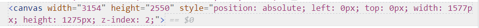
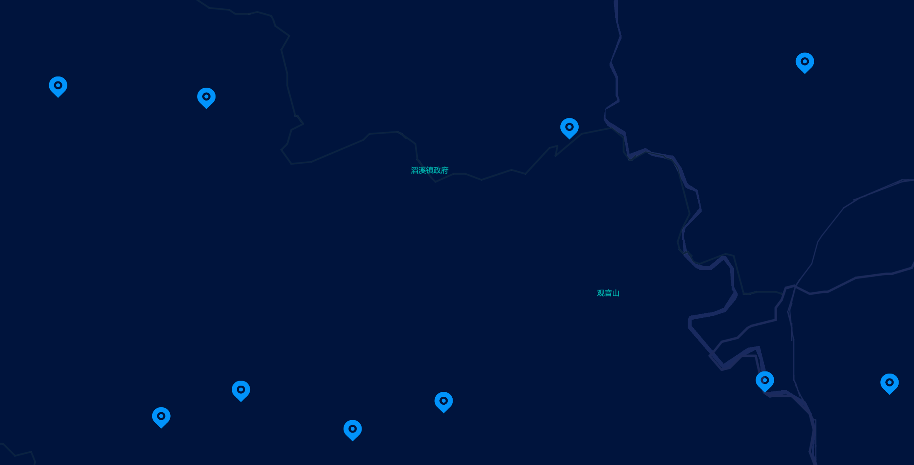

# 一种地图海量点位的渲染方法

## 2、现有的技术方案

在信息化的不断发展中，有大量的企业、行业都在进行数字化转型。在数字化转型的过程中，往往需要将企业、行业的信息进行可视化展示。而WEB网页地图作为一种直观的信息展示方式，被广泛的应用到各个领域。它可以将信息以地理位置的方式展示出来，使得人们可以更加直观的了解到信息的分布情况。但是在实际的应用中，往往会遇到海量点位的渲染问题。这里的海量点位，指的是点位数量在上万级别的点位。在这种情况下，如果采用传统的渲染方式，往往会导致地图的渲染速度变慢，甚至会导致浏览器崩溃。因此，如何在海量点位的情况下，实现地图的快速渲染，是一个亟待解决的问题。
专利CN105677912A公开了一种在线电子地图的海量数据显示方法，主要内容是对数据进行预处理和对地图进行分块。该方法包括以下步骤：1、网页地理系统发送数据请求信息；2、数据处理发布服务端；3、判断地图瓦片是否存在，根据海量数据符号化信息生成切片；4、从瓦片库中查找瓦片数据；5、地图瓦片在网页地理系统中展示。

## 3、现有技术的缺点及本申请提案要解决的技术问题

在Web前端领域中，通常使用数据API接口获取数据，然后使用模板引擎将数据渲染到页面上来实现页面上的数据渲染。这种方式在数据量较少的情况下是可行的，但是当数据量过大时，就会遇到性能问题，例如页面卡顿或崩溃。在地图应用中，经常会遇到数据量巨大的情况，例如某个企业拥有十万台设备，这些设备分布在全国各地且都有位置信息。现在需要在地图上标注这些设备的位置，这就会遇到海量点位的渲染问题。在地图上渲染点位主要有两种方式：一种是直接渲染，另一种是通过渲染热力图来实现。这两种方式各有优缺点，下面进行详细说明。

一、直接渲染的方式是在地图上直接渲染点位，并将点位的图片渲染到对应的位置。这种方式的优点是可以直接看到点位的位置，但是缺点有以下几点：

当点位过多时，会导致地图卡顿或崩溃，因为每一个点位在页面上都是一个DOM节点，对DOM进行操作会触发浏览器的重绘和重排，这个过程非常耗时并影响性能。

对DOM进行操作会导致页面的回流，即重新计算元素的位置和大小，这个过程也非常耗时。通常情况下，前端应该尽量避免对DOM进行操作，但是在地图上渲染点位时，不可避免地需要对地图进行拖拉拽、缩放等操作，这些操作都会导致页面的回流。

二、热力图渲染的方式是在地图上渲染热力图。这种方式的优点是可以看到点位的分布情况，但是缺点是无法看到点位的具体位置。

CN110647608B提供了一种在线电子地图海量数据显示方法。该方法将数据在服务端进行符号化处理，根据处理后的数据和并且按照网页地理系统底图的参数生成瓦片，然后将瓦片返回给前端。这种方法又会导致以下的问题：
1、该方法需要在服务端进行数据处理、瓦片匹配以及数据分配，需要一定的计算资源和时间。因此，对于实时性要求较高的应用场景会不太适用。
2、该方法需要在服务端进行瓦片缓存，需要一定的存储资源和空间，因此对于存储资源有限的应用场景会不太适用。
本申请提案要解决的技术问题是如何在海量点位的情况下实现地图的快速渲染。在点位不太密集的情况下，可以看到点位的具体位置，也可以看到点位的分布情况。在点位过于密集的情况下，利用点聚合的方式，可以看到点位的分布情况。提高地图的渲染速度，从而提高用户体验。

## 本申请提案的技术方案的详细阐述

为了解决上述问题，本文提出了一种网页海量数据的渲染方法，可以用于地图、echart等可视化组件库，以及词云等场景中点位或文字的渲染。该方法可以有效解决大量DOM节点操作时浏览器重绘和重排带来的性能影响及时间消耗。
在该方法中，直接摒弃掉对DOM的操作，而是通过canvas来实现点位的渲染。canvas是HTML5新增的元素，可以通过JavaScript来绘制图形。canvas的优点是可以通过JavaScript来绘制图形，而不需要对DOM进行操作，因此可以避免对DOM进行操作时带来的性能影响及时间消耗，同时也可以避免DOM操作时浏览器回流导致的页面卡顿或崩溃问题。
最终生成的html代码只有一个canvas节点，因此可以有效减少DOM节点的数量，从而提高渲染速度。同时，由于canvas是HTML5新增的元素，因此在浏览器兼容性方面也不会有太大的问题。生成的html结构如下图所示：

在该方法中，首先需要将点位的位置信息转换为canvas的坐标信息，然后将点位的图片渲染到对应的位置。大致的流程如下：
// 将点位的经纬度坐标点转换成像素坐标
const pixel = map.pointToOverlayPixel(point);
将像素坐标应用到 Canvas 画布上，使用 Canvas API 中的 drawImage 方法。
// 创建一个图片对象
// 等待图片加载完成后再进行绘制
img.onload = function() {
  // 绘制图片
  ctx.drawImage(img, pixel.x, pixel.y, 50, 50);
};
这样就能够实现点位的渲染。效果如下图所示：

在点位过于密集的情况下，可以通过点聚合的方式来实现点位的渲染。点聚合的方式是将点位按照一定的规则进行聚合，然后将聚合后的点位渲染到地图上。点聚合的方式可以有效地解决点位过于密集时地图卡顿或崩溃的问题，同时也可以有效地解决点位过于密集时无法看到点位的具体位置的问题。
计算多点位的聚合点位的坐标时，可以通过以下公式来计算：
centerX = (sum of all pointX) / number of points
centerY = (sum of all pointY) / number of points
其中，centerX和centerY分别表示聚合点位的坐标，pointX和pointY分别表示点位的坐标，number of points表示点位的数量。

canvas的缺点是不支持事件绑定，本方法将获取鼠标点击位置的事件绑定到canvas的父元素上，然后通过鼠标点击位置的坐标来判断鼠标点击的位置是否在点位上，从而实现对点位的点击事件的绑定。比如设备点位的信息弹窗。效果如下图所示：

在可视化大屏中，通常会使用transform: scale()对整个页面进行缩放，以实现不同分辨率屏幕的适配。但是，如果直接对canvas进行缩放，会导致鼠标点击位置的坐标不准确，从而无法实现对点位的点击事件的绑定。因此，本方法将整个地图放在设置了scale的div的同级，使用绝对定位和vw、vh来设置地图的位置和宽高，以避免缩放对鼠标点击位置的坐标造成影响。

## 本申请提案的关键点和预保护点

本申请提案旨在提供一种网页海量数据的渲染方法，主要致力于网页前端的页面渲染优化，解决传统数据渲染方式在海量数据场景下的卡顿和崩溃问题。具体包括以下关键点：

1、通过使用canvas来实现点位的渲染，避免对DOM进行操作时带来的性能影响及时间消耗，同时也可以避免DOM操作时浏览器回流导致的页面卡顿或崩溃问题。
2、通过点聚合的方式来实现点位的渲染，从而可以有效地解决点位过于密集时地图卡顿或崩溃的问题，同时也可以有效地解决点位过于密集时无法看到点位的具体位置的问题。
3、通过鼠标点击位置的坐标与canvas画布上的点位坐标来判断鼠标点击的位置是否在点位上，从而实现对点位的点击事件的绑定。该方法解决了canvas不支持事件绑定的问题。
4、将整个地图放在设置了scale的div的同级，使用绝对定位和vw、vh来设置地图的位置和宽高，以实现地图的自适应。该方法解决了地图在不同分辨率下显示不同的问题，避免了因为div的scale导致鼠标点击位置的坐标计算错误的问题。

## 最接近的现有技术相比，本申请提案有何技术优点

1、可以有效地减少数据传输的量，不用每次都等后端处理瓦片层，从而减少了数据传输的时间，提高了数据的传输效率。
2、可以有效地减少DOM节点的数量，从而提高了渲染速度。
3、可以避免DOM操作时带来的性能影响及时间消耗，同时也可以避免DOM操作时浏览器回流导致的页面卡顿或崩溃问题。
4、可以有效地解决点位过于密集时地图卡顿或崩溃的问题，同时也可以有效地解决点位过于密集时无法看到点位的具体位置的问题。
5、可以解决canvas不支持事件绑定的问题。
6、可以解决地图在不同分辨率下显示不同的问题，避免了因为div的scale导致鼠标点击位置的坐标计算错误的问题。

## 分析评述

本发明中，提供了一种网页海量数据的渲染方法，主要致力于网页前端的页面渲染优化，解决传统数据渲染方式在海量数据场景下的卡顿和崩溃问题。适用与地图、echarts等可视化组件库、词云等场景中的海量数据的渲染。解决了传统点位渲染方式在海量数据场景下的卡顿和崩溃问题，大幅度提高了网页前端的页面渲染效率，提高了用户体验。
